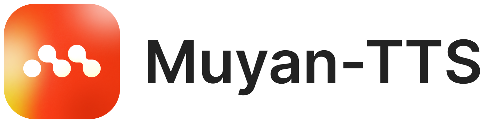
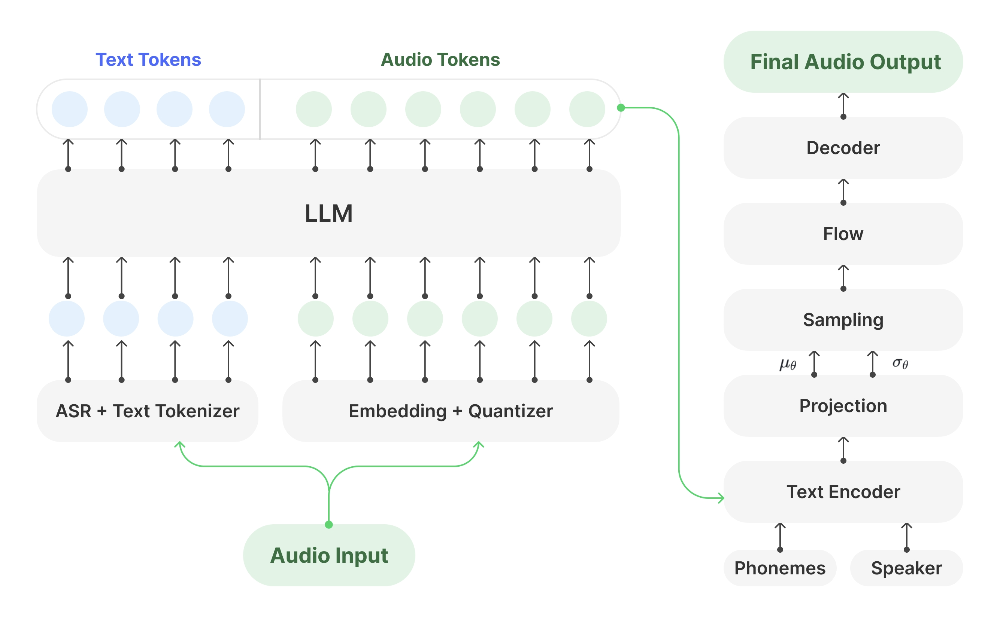
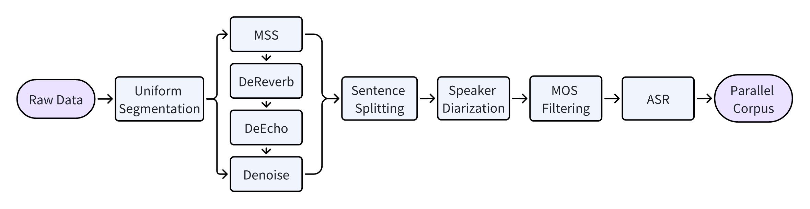

<p align="center">
    
<p>

<p align="center">
Muyan-TTS <a href="https://huggingface.co/MYZY-AI/Muyan-TTS">🤗</a>&nbsp; | Muyan-TTS-SFT <a href="https://huggingface.co/MYZY-AI/Muyan-TTS-SFT">🤗</a>&nbsp; | &nbsp;<a href="">Technical Report</a> &nbsp;&nbsp;
</p>

Muyan-TTS is a trainable TTS model designed for podcast applications within a $50,000 budget, which is pre-trained on over 100,000 hours of podcast audio data, enabling zero-shot TTS synthesis with high-quality voice generation. Furthermore, Muyan-TTS supports speaker adaptation with dozens of minutes of target speech, making it highly customizable for individual voices.

## 🔥🔥🔥 News!!

* April 28, 2025: 👋 We release the zero-shot TTS model weights of [Muyan-TTS](https://huggingface.co/MYZY-AI/Muyan-TTS).
* April 28, 2025: 👋 We release the few-shot TTS model weights of [Muyan-TTS-SFT](https://huggingface.co/MYZY-AI/Muyan-TTS-SFT), which is trained based on [Muyan-TTS](https://huggingface.co/MYZY-AI/Muyan-TTS) with dozens of minutes of a single speaker's speech.
* April 28, 2025: 👋 We release the training code from the base model to the SFT model for speaker adaptation.
* April 28, 2025: 👋 We release the [technical report]() of Muyan-TTS.

## Summary


Framework of Muyan-TTS. Left is an LLM that models the parallel corpus of text (in blue) and audio (in green) tokens. Right is a SoVITS model that decodes the generated audio tokens, as well as phonemes and speaker embeddings, into the audio waveform.


Data processing pipeline. The final dataset comprises over 100,000 hours of high-quality speech and corresponding transcriptions, forming a robust parallel corpus suitable for TTS training in long-form audio scenarios such as podcasts.

| Training Cost   | Data Processing   | Pre-training of LLM| Training of Decoder | Total |
|-------|-------|-------|-------|-------|
| in GPU Hours   | 60K(A10)   | 19.2K(A100)| 1.34K(A100) | - |
| in USD   | $30K   | $19.2K| $1.34K | $50.54K |

Training costs of Muyan-TTS, assuming the rental price of A10 and A100 in GPU hour is $0.5 and $1, respectively.

## Demo

https://github.com/user-attachments/assets/a20d407c-15f8-40da-92b7-65e92e4f0c06

The three audios in the "Base model" column and the first audio in the "SFT model" column are synthesized by the open-sourced Muyan-TTS and Muyan-TTS-SFT, respectively. The last two audios in the "SFT model" column are generated by the SFT models trained separately on the base model, which are not open for use.

## Install
### Clone & Install
```sh
git clone https://github.com/MYZY-AI/Muyan-TTS.git
cd Muyan-TTS

conda create -n muyan-tts python=3.10 -y
conda activate muyan-tts
make build
```

You need to install ```FFmpeg```. If you're using Ubuntu, you can install it with the following command:
```sh
sudo apt update
sudo apt install ffmpeg
```


### Model Download 
| Models   | Links   |
|-------|-------|
| Muyan-TTS   | [huggingface](https://huggingface.co/MYZY-AI/Muyan-TTS) \| [modelscope](https://modelscope.cn/models/MYZY-AI/Muyan-TTS)   |
| Muyan-TTS-SFT   | [huggingface](https://huggingface.co/MYZY-AI/Muyan-TTS-SFT) \| [modelscope](https://modelscope.cn/models/MYZY-AI/Muyan-TTS-SFT)   |

Additionally, you need to download the weights of [chinese-hubert-base](https://huggingface.co/TencentGameMate/chinese-hubert-base).

Place all the downloaded models in the ```pretrained_models``` directory. Your directory structure should look similar to the following:
```
pretrained_models
├── chinese-hubert-base
├── Muyan-TTS
└── Muyan-TTS-SFT
```

## Quickstart
```sh
python tts.py
```
This will synthesize speech through inference. The core code is as follows:
```py
async def main(model_type, model_path):
    tts = Inference(model_type, model_path, enable_vllm_acc=False)
    wavs = await tts.generate(
        ref_wav_path="assets/Claire.wav",
        prompt_text="Although the campaign was not a complete success, it did provide Napoleon with valuable experience and prestige.",
        text="Welcome to the captivating world of podcasts, let's embark on this exciting journey together."
    )
    output_path = "logs/tts.wav"
    with open(output_path, "wb") as f:
        f.write(next(wavs))  
    print(f"Speech generated in {output_path}")
```
You need to specify the ```prompt speech```, including the ```ref_wav_path``` and its ```prompt text```, and the ```text``` to be synthesized. The synthesized speech is saved by default to ```logs/tts.wav```.

Additionally, you need to specify ```model_type``` as either ```base``` or ```sft```, with the default being ```base```.

When you specify the ```model_type``` to be ```base```, you can change the ```prompt speech``` to arbitrary speaker for zero-shot TTS synthesis.

When you specify the ```model_type``` to be ```sft```, you need to keep the ```prompt speech``` unchanged because the ```sft``` model is trained on Claire's voice.

## API Usage
```sh
python api.py
```
Using the API mode automatically enables vLLM acceleration, and the above command will start a service on the default port ```8020```. Additionally, LLM logs will be saved in ```logs/llm.log```.

You can send a request to the API using the example below:
```py
import time
import requests
TTS_PORT=8020
payload = {
    "ref_wav_path": "assets/Claire.wav",
    "prompt_text": "Although the campaign was not a complete success, it did provide Napoleon with valuable experience and prestige.",
    "text": "Welcome to the captivating world of podcasts, let's embark on this exciting journey together."
}
start = time.time()

url = f"http://localhost:{TTS_PORT}/get_tts"
response = requests.post(url, json=payload)
audio_file_path = "logs/tts.wav"
with open(audio_file_path, "wb") as f:
    f.write(response.content)
    
print(time.time() - start)
```

By default, the synthesized speech will be saved at ```logs/tts.wav```.

Additionally, you need to specify ```model_type``` as either ```base``` or ```sft```, with the default being ```base```.

## Training

We use ```LibriSpeech``` as an example. You can use your own dataset instead, but you need to organize the data into the format shown in ```data_process/examples```.

If you haven't downloaded ```LibriSpeech``` yet, you can download the dev-clean set using:
```sh
wget https://www.openslr.org/resources/12/dev-clean.tar.gz -P path/to/save
```
After downloading, specify the ```librispeech_dir``` in ```prepare_sft_dataset.py``` to match the download location. Then run ```./train.sh```, which will automatically process the data and generate ```data/tts_sft_data.json```. We will use the first speaker from the LibriSpeech subset for fine-tuning. You can also specify a different speaker as needed in ```data_process/text_format_conversion.py```.

Note that if an error occurs during the process, resolve the error, delete the existing contents of the data folder, and then rerun ```train.sh```.

After generating ```data/tts_sft_data.json```, train.sh will automatically copy it to ```llama-factory/data``` and add the following field to ```dataset_info.json```:
```json
"tts_sft_data": {
    "file_name": "tts_sft_data.json"
}
```
Finally, it will automatically execute the ```llamafactory-cli train``` command to start training. You can adjust training settings using ```training/sft.yaml```. By default, the trained weights will be saved to ```pretrained_models/Muyan-TTS-new-SFT```.

You can directly deploy your trained model using the API tool above. During inference, you need to specify the ```model_type``` to be ```sft``` and replace the ```ref_wav_path``` and ```prompt text``` with a sample of the speaker's voice you trained on.

## Acknowledgment

The model is trained base on [Llama-3.2-3B](https://huggingface.co/meta-llama/Llama-3.2-3B).

We borrow a lot of code from [GPT-SoVITS](https://github.com/RVC-Boss/GPT-SoVITS).

We borrow a lot of code from [LLaMA-Factory](https://github.com/hiyouga/LLaMA-Factory).
